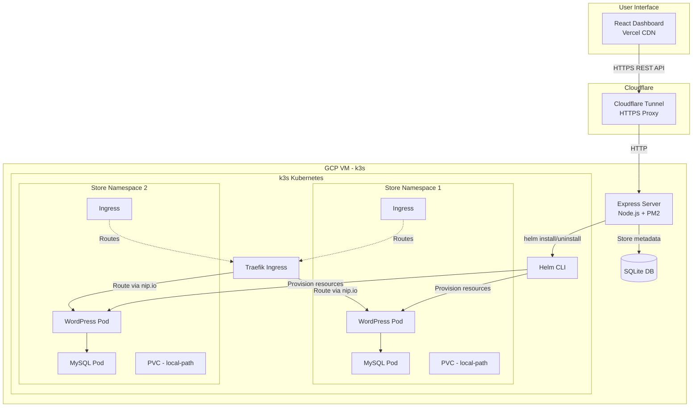
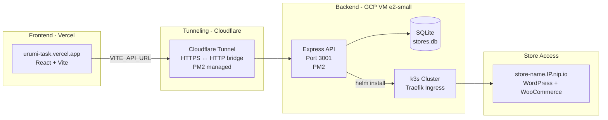
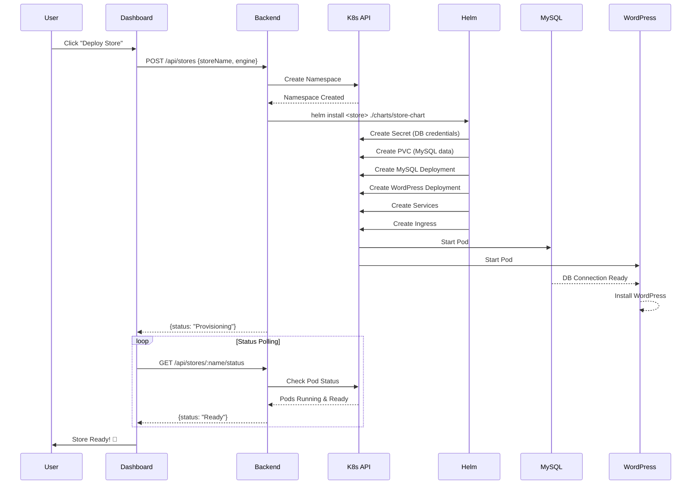
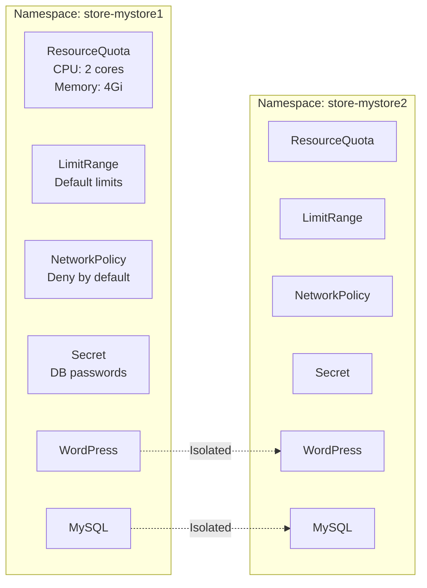

# Urumi Cloud - Multi-Tenant Kubernetes Store Orchestrator

A production-ready platform for provisioning and managing isolated WooCommerce stores on Kubernetes using Helm charts and namespace-based multi-tenancy.

## 📋 Table of Contents

- [Overview](#overview)
- [Architecture](#architecture)
- [Local Setup](#local-setup)
- [Production Deployment (GCP/k3s)](#production-deployment)
- [Creating a Store & Placing an Order](#creating-a-store--placing-an-order)
- [System Design & Tradeoffs](#system-design--tradeoffs)
- [Project Structure](#project-structure)
- [API Endpoints](#api-endpoints)

---

## Overview

Urumi Cloud enables automated provisioning of isolated ecommerce stores (WooCommerce/MedusaJS) with:

- **Namespace isolation** per store
- **Automated provisioning** via Helm charts
- **Real-time status tracking** of deployments
- **Resource quotas** and security policies
- **Local-to-production portability** with configuration-only changes

**Tech Stack:**
- Backend: Node.js + Express + SQLite
- Frontend: React + TypeScript + Tailwind CSS
- Infrastructure: Kubernetes (Docker Desktop local / k3s prod)
- Package Manager: Helm 3
- Ingress: NGINX (local) / Traefik (prod)
- Frontend Hosting: Vercel
- Tunneling: Cloudflare Tunnel (HTTPS for backend)

---
## Tech Stack Used 

 

## Architecture

### System Architecture



### Deployment Architecture



### Store Provisioning Flow



### Resource Isolation Model



---

## Local Setup

### Prerequisites

- **Docker Desktop** (Windows/Mac) or **Minikube** (Linux)
- **kubectl** v1.28+
- **Helm** v3.12+
- **Node.js** v18+
- **Git**

### 1. Clone Repository

```bash
git clone https://github.com/rah7202/urumi-task.git
cd urumi-task
```

### 2. Enable Kubernetes in Docker Desktop

1. Open Docker Desktop
2. Settings → Kubernetes → ✅ Enable Kubernetes
3. Wait for "Kubernetes is running" (green indicator)

Verify:
```bash
kubectl cluster-info
kubectl get nodes
```

### 3. Install NGINX Ingress Controller

```bash
kubectl apply -f https://raw.githubusercontent.com/kubernetes/ingress-nginx/controller-v1.10.0/deploy/static/provider/cloud/deploy.yaml

# Wait for controller to be ready
kubectl wait --namespace ingress-nginx \
  --for=condition=ready pod \
  --selector=app.kubernetes.io/component=controller \
  --timeout=120s
```

### 4. Configure Local DNS

**Windows:**
1. Open Notepad as Administrator
2. Open: `C:\Windows\System32\drivers\etc\hosts`
3. Add these lines:
```
127.0.0.1   my-test-store1.local
127.0.0.1   my-test-store2.local
127.0.0.1   my-test-store3.local
```
4. Save and close

**Mac/Linux:**
```bash
sudo nano /etc/hosts
# Add the same lines as Windows
```

### 5. Start Backend Server

```bash
cd backend
npm install
npm start

# Server runs on http://localhost:3001
```

### 6. Start Frontend Dashboard

```bash
cd frontend
npm install
npm run dev

# Dashboard runs on http://localhost:5173
```

### 7. Access Dashboard

Open browser: `http://localhost:5173`

---

## Production Deployment

### Architecture Overview

```
Vercel (Frontend) → Cloudflare Tunnel (HTTPS) → GCP VM (Backend + k3s)
```

- **Frontend** is deployed on Vercel for global CDN delivery
- **Backend** runs on GCP e2-small VM managed by PM2
- **Cloudflare Tunnel** provides HTTPS bridge (no open ports needed)
- **Stores** are accessible via `nip.io` wildcard DNS

### Google Cloud Platform (k3s) Setup

#### 1. Create GCP VM

```bash
# In GCP Console → Compute Engine → VM Instances
# Create instance with:
# - Name: k3s-server
# - Region: us-central1 (free tier)
# - Machine type: e2-small (2GB RAM)
# - Boot disk: Ubuntu 22.04 LTS, 30GB
# - Firewall: Allow HTTP & HTTPS traffic
```

#### 2. SSH into VM and Install k3s

```bash
sudo apt update && sudo apt upgrade -y
curl -sfL https://get.k3s.io | sh -

# Verify
sudo kubectl get nodes
```

#### 3. Add Swap Space (Required for e2-small)

```bash
sudo fallocate -l 2G /swapfile
sudo chmod 600 /swapfile
sudo mkswap /swapfile
sudo swapon /swapfile
echo '/swapfile none swap sw 0 0' | sudo tee -a /etc/fstab
```

#### 4. Clone Repository

```bash
git clone https://github.com/rah7202/urumi-task.git
cd urumi-task/backend
npm install
```

#### 5. Start Backend with PM2

```bash
npm install -g pm2

pm2 start src/server.js --name urumi-backend
pm2 save
pm2 startup
```

#### 6. Setup Cloudflare Tunnel

```bash
# Download cloudflared
wget https://github.com/cloudflare/cloudflared/releases/latest/download/cloudflared-linux-amd64 -O cloudflared
chmod +x cloudflared
sudo mv cloudflared /usr/local/bin/

# Start tunnel and note the HTTPS URL
cloudflared tunnel --url http://localhost:3001

# Add to PM2 for persistence
pm2 start "cloudflared tunnel --url http://localhost:3001" --name urumi-tunnel
pm2 save
```

#### 7. Deploy Frontend to Vercel

1. Push code to GitHub
2. Connect repo to [Vercel](https://vercel.com)
3. Set **Root Directory**: `frontend`
4. Add environment variable:
   ```
   VITE_API_URL = https://your-tunnel-url.trycloudflare.com
   ```
5. Deploy!

#### 8. Environment Detection (Auto)

The backend auto-detects production vs local:

```javascript
// Production detected by kubeconfig existence
const isProduction = require('fs').existsSync('/home/user/.kube/config') && 
                     process.env.NODE_ENV !== 'development';

// Store URLs
const storeHost = isProduction 
  ? `${storeName}.YOUR_IP.nip.io`    // GCP
  : `${storeName}.local`;             // Local
```

#### 9. Helm Values per Environment

| Setting | Local (`values-local.yaml`) | Production (`values-prod.yaml`) |
|---------|-----------------------------|---------------------------------|
| Ingress class | `nginx` | `traefik` |
| Storage class | `hostpath` | `local-path` |
| Store URL | `store.local` | `store.IP.nip.io` |
| Pull policy | `IfNotPresent` | `Always` |

#### 10. Updating Tunnel URL

When Cloudflare tunnel restarts it gets a new URL (free tier limitation):

```bash
# 1. Get new URL
pm2 stop urumi-tunnel
cloudflared tunnel --url http://localhost:3001
# Note new URL

# 2. Update Vercel env var
# Vercel Dashboard → Settings → Environment Variables → VITE_API_URL

# 3. Redeploy frontend
git commit --allow-empty -m "trigger: new tunnel url"
git push origin main
```

> **Note:** CORS is pre-configured to allow all `*.vercel.app` and `*.trycloudflare.com` domains — no backend changes needed when URL changes.

---

## Creating a Store & Placing an Order

### Creating a Store

#### Via Dashboard (Recommended)

1. Open dashboard: `http://localhost:5173` (local) or `https://urumi-task.vercel.app` (prod)
2. Enter store name (e.g., "my-shop")
3. Select engine: **WordPress + WooCommerce**
4. Click **"Deploy Store"**
5. Wait for status to change: `Provisioning` → `Installing` → `Ready` (~2-5 minutes)
6. Click the **external link icon** to open your store

#### Via API

```bash
curl -X POST http://localhost:3001/api/stores \
  -H "Content-Type: application/json" \
  -d '{
    "storeName": "my-shop",
    "engine": "woocommerce"
  }'
```

### Completing WordPress Setup

1. Open your store URL:
   - **Local:** `http://my-shop.local`
   - **Production:** `http://my-shop.YOUR_IP.nip.io`

2. **WordPress Installation Wizard:**
   - Site Title: `My Test Store`
   - Username: `admin`
   - Password: (generate & save it!)
   - Email: `admin@example.com`
   - Click **"Install WordPress"**

3. **Install WooCommerce:**
   - Login to WordPress admin
   - Navigate to: **Plugins → Add New Plugin**
   - Search: `WooCommerce`
   - Click **"Install Now"** → **"Activate"**

4. **WooCommerce Setup Wizard:**
   - Industry: Choose any (e.g., "Clothing")
   - Payments: ✅ Enable **"Cash on Delivery (COD)"**
   - Sample Products: ✅ **"Yes, import sample products"**
   - Click **"Finish Setup"**

### Placing a Test Order

1. Go to storefront
2. Browse products → **"Add to Cart"**
3. **"Proceed to Checkout"**
4. Fill checkout form with test details
5. Select: **"Cash on Delivery"**
6. Click **"Place Order"**
7. ✅ Order confirmation page appears!

### Verifying the Order

1. Login to WordPress admin: `/wp-admin`
2. Navigate to: **WooCommerce → Orders**
3. Order status: **"Processing"** ✅

**🎉 Store provisioning and order flow complete!**

---

## System Design & Tradeoffs

### Architecture Choices

#### 1. Namespace-Based Multi-Tenancy

**Choice:** Each store gets its own Kubernetes namespace.

**Pros:**
- Strong resource isolation (quotas, limits, network policies)
- Clean deletion (delete namespace = delete all resources)
- Native K8s RBAC boundaries

**Cons:**
- Namespace proliferation (100 stores = 100 namespaces)
- Slightly higher memory overhead vs shared namespace

#### 2. Helm for Templating & Deployment

**Choice:** Helm charts with environment-specific values files.

**Pros:**
- Declarative, versioned deployments
- Easy rollback (`helm rollback`)
- Values files for local/prod differences

**Cons:**
- Learning curve for complex templating
- No built-in drift detection

#### 3. SQLite for Store Metadata

**Choice:** Local SQLite database for store records.

**Pros:**
- Zero-config, no external database
- Lightweight for prototype/demo
- Easy backup (single file)

**Cons:**
- Not horizontally scalable
- Single point of failure

**Production Alternative:** PostgreSQL with connection pooling

#### 4. Cloudflare Tunnel for HTTPS

**Choice:** Cloudflare Tunnel to expose backend securely without open ports.

**Pros:**
- No firewall rules needed
- Automatic HTTPS (no cert management)
- DDoS protection included
- Free tier available

**Cons:**
- Free tier URLs change on restart
- Adds latency hop
- Third-party dependency

**Production Alternative:** Named Cloudflare Tunnel (permanent URL, requires domain)

#### 5. Vercel for Frontend Hosting

**Choice:** Vercel for React frontend hosting.

**Pros:**
- Global CDN (fast worldwide)
- Auto-deploy on GitHub push
- Free tier sufficient
- Preview deployments

**Cons:**
- Frontend separate from backend (CORS required)
- Env var change requires redeploy

#### 6. Polling for Status Updates

**Choice:** Frontend polls `/api/stores/:name/status` every 5 seconds.

**Pros:**
- Simple implementation
- No WebSocket infrastructure needed

**Cons:**
- Higher API load
- 5-second latency for status updates

**Production Alternative:** WebSockets or Server-Sent Events

---

### Idempotency & Failure Handling

#### Store Creation (POST /api/stores)

| Failure Point | Handling | Cleanup |
|---------------|----------|---------|
| Namespace creation fails | Return 500, no DB record | N/A |
| Helm install fails | Delete namespace, return 500 | Automatic |
| Database insert fails | Helm installed but not tracked | Manual cleanup (logged) |

#### Store Deletion (DELETE /api/stores/:name)

**Cleanup Order:**
1. `helm uninstall` (deletes Helm-managed resources)
2. `kubectl delete namespace` (deletes remaining resources + PVCs)
3. Remove from SQLite database

---

### Production vs Local Differences

| Feature | Local | Production (GCP) |
|---------|-------|-----------------|
| Kubernetes | Docker Desktop | k3s on GCP VM |
| Ingress | NGINX | Traefik |
| Storage | hostpath | local-path |
| Store URL | `store.local` | `store.IP.nip.io` |
| DNS | Windows hosts file | nip.io (automatic) |
| Frontend | localhost:5173 | Vercel CDN |
| Backend URL | localhost:3001 | Cloudflare Tunnel |
| HTTPS | No | Yes (Cloudflare) |
| Process Manager | npm start | PM2 |

---

## API Endpoints

### Store Management

#### `GET /api/stores`
List all stores.

**Response:**
```json
[
  {
    "id": 1,
    "store_name": "my-shop",
    "engine": "woocommerce",
    "namespace": "store-myshop",
    "status": "Ready",
    "url": "http://my-shop.34.135.50.141.nip.io",
    "created_at": "2026-02-13T10:00:00.000Z"
  }
]
```

---

#### `POST /api/stores`
Create a new store.

**Request:**
```json
{
  "storeName": "my-shop",
  "engine": "woocommerce"
}
```

**Response:**
```json
{
  "success": true,
  "status": "Provisioning",
  "storeName": "my-shop",
  "namespace": "store-myshop",
  "url": "http://my-shop.34.135.50.141.nip.io"
}
```

---

#### `GET /api/stores/:name/status`
Check store provisioning status.

**Possible Statuses:**
- `Provisioning` - Resources being created
- `Installing` - Pods starting but not ready
- `Ready` - All pods running and ready
- `Failed` - Provisioning timeout or error

---

#### `DELETE /api/stores/:name`
Delete a store and all its resources.

---

### Metrics & Admin

#### `GET /api/admin/metrics`
Get platform metrics.

#### `GET /api/admin/audit?limit=20`
Get audit log (last N actions).

#### `GET /api/health`
Check system health.

---

## License

MIT License - see LICENSE file for details.

---

## Author

Built for Urumi AI SDE Internship Round 1 by Rahul Pidiyar

LinkedIn: https://www.linkedin.com/in/rahul-pidiyar-101115284/

GitHub: https://github.com/rah7202/urumi-task