# Urumi Cloud - Multi-Tenant Kubernetes Store Orchestrator

A production-ready platform for provisioning and managing isolated WooCommerce stores on Kubernetes using Helm charts and namespace-based multi-tenancy.

## 📋 Table of Contents

- [Overview](#overview)
- [Architecture](#architecture)
- [Local Setup](#local-setup)
- [Production Deployment (GCP/k3s)](#production-deployment)
- [Creating a Store & Placing an Order](#creating-a-store--placing-an-order)
- [System Design & Tradeoffs](#system-design--tradeoffs)
- [Project Structure](#project-structure)
- [API Endpoints](#api-endpoints)

---

## Overview

Urumi Cloud enables automated provisioning of isolated ecommerce stores (WooCommerce/MedusaJS) with:

- **Namespace isolation** per store
- **Automated provisioning** via Helm charts
- **Real-time status tracking** of deployments
- **Resource quotas** and security policies
- **Local-to-production portability** with configuration-only changes

**Tech Stack:**
- Backend: Node.js + Express + SQLite
- Frontend: React + TypeScript + Tailwind CSS
- Infrastructure: Kubernetes (Docker Desktop local / k3s prod)
- Package Manager: Helm 3
- Ingress: NGINX (local) / Traefik (prod)

---
## Tech Stack Used 

 

## Architecture

### System Architecture


### Store Provisioning Flow

```mermaid
sequenceDiagram
    participant User
    participant Dashboard
    participant Backend
    participant K8s API
    participant Helm
    participant MySQL
    participant WordPress
    
    User->>Dashboard: Click "Deploy Store"
    Dashboard->>Backend: POST /api/stores {storeName, engine}
    Backend->>K8s API: Create Namespace
    K8s API-->>Backend: Namespace Created
    Backend->>Helm: helm install <store> ./charts/store-chart
    Helm->>K8s API: Create Secret (DB credentials)
    Helm->>K8s API: Create PVC (MySQL data)
    Helm->>K8s API: Create MySQL Deployment
    Helm->>K8s API: Create WordPress Deployment
    Helm->>K8s API: Create Services
    Helm->>K8s API: Create Ingress
    K8s API->>MySQL: Start Pod
    K8s API->>WordPress: Start Pod
    MySQL-->>WordPress: DB Connection Ready
    WordPress-->>WordPress: Install WordPress
    Backend-->>Dashboard: {status: "Provisioning"}
    
    loop Status Polling
        Dashboard->>Backend: GET /api/stores/:name/status
        Backend->>K8s API: Check Pod Status
        K8s API-->>Backend: Pods Running & Ready
        Backend-->>Dashboard: {status: "Ready"}
    end
    
    Dashboard->>User: Store Ready! 🎉
```



### Resource Isolation Model


---

## Local Setup

### Prerequisites

- **Docker Desktop** (Windows/Mac) or **Minikube** (Linux)
- **kubectl** v1.28+
- **Helm** v3.12+
- **Node.js** v18+
- **Git**

### 1. Clone Repository

```bash
git clone https://github.com/rah7202/urumi-task.git
cd urumi-task
```

### 2. Enable Kubernetes in Docker Desktop

1. Open Docker Desktop
2. Settings → Kubernetes → ✅ Enable Kubernetes
3. Wait for "Kubernetes is running" (green indicator)

Verify:
```bash
kubectl cluster-info
kubectl get nodes
```

### 3. Install NGINX Ingress Controller

```bash
kubectl apply -f https://raw.githubusercontent.com/kubernetes/ingress-nginx/controller-v1.10.0/deploy/static/provider/cloud/deploy.yaml

# Wait for controller to be ready
kubectl wait --namespace ingress-nginx \
  --for=condition=ready pod \
  --selector=app.kubernetes.io/component=controller \
  --timeout=120s
```

### 4. Configure Local DNS

**Windows:**
1. Open Notepad as Administrator
2. Open: `C:\Windows\System32\drivers\etc\hosts`
3. Add these lines:
```
127.0.0.1   my-test-store1.local
127.0.0.1   my-test-store2.local
127.0.0.1   my-test-store3.local
```
4. Save and close

**Mac/Linux:**
```bash
sudo nano /etc/hosts
# Add the same lines as Windows
```

### 5. Start Backend Server

```bash
cd backend
npm install
npm start

# Server runs on http://localhost:3001
```

### 6. Start Frontend Dashboard

```bash
cd frontend
npm install
npm run dev

# Dashboard runs on http://localhost:5173
```

### 7. Access Dashboard

Open browser: `http://localhost:5173`

---

## Production Deployment

### Google Cloud Platform (Free Tier)

#### 1. Create GCP VM

```bash
# In GCP Console → Compute Engine → VM Instances
# Create instance with:
# - Name: k3s-server
# - Region: us-central1 (free tier)
# - Machine type: e2-micro (free tier)
# - Boot disk: Ubuntu 22.04 LTS, 30GB
# - Firewall: Allow HTTP & HTTPS traffic
```

#### 2. SSH into VM

```bash
# From GCP Console, click "SSH" button
# Or use gcloud CLI:
gcloud compute ssh k3s-server --zone=us-central1-a
```

#### 3. Install k3s

```bash
# Update system
sudo apt update && sudo apt upgrade -y

# Install k3s (lightweight Kubernetes)
curl -sfL https://get.k3s.io | sh -

# Verify installation
sudo kubectl get nodes
# Should show: k3s-server   Ready   control-plane,master
```

#### 4. Get External IP

```bash
curl ifconfig.me
# Note this IP - you'll use it for ingress hostnames
```

#### 5. Configure Local kubectl Access

On the **VM**:
```bash
sudo cat /etc/rancher/k3s/k3s.yaml
```

On your **local machine**:
```bash
# Create config file
mkdir -p ~/.kube
nano ~/.kube/gcloud-config

# Paste the k3s.yaml content
# IMPORTANT: Replace this line:
#   server: https://127.0.0.1:6443
# With:
#   server: https://YOUR_EXTERNAL_IP:6443
```

#### 6. Open Firewall for kubectl

In GCP Console → VPC Network → Firewall → Create:
```
Name: allow-k3s-api
Targets: All instances
Source IP ranges: YOUR_HOME_IP/32  (from whatismyip.com)
Protocols: tcp:6443
```

#### 7. Test kubectl Access

```bash
export KUBECONFIG=~/.kube/gcloud-config
kubectl get nodes
# Should show your k3s node!
```

#### 8. Clone Repo on VM

```bash
# SSH into VM
git clone https://github.com/rah7202/urumi-task.git
cd urumi-task/backend
```

#### 9. Deploy a Store

```bash
# From local machine with kubectl configured
export KUBECONFIG=~/.kube/gcloud-config

helm install prod-store1 ./charts/store-chart \
  -f ./charts/store-chart/values.yaml \
  -f ./charts/store-chart/values-prod.yaml \
  --set ingress.host=prod-store1.YOUR_EXTERNAL_IP.nip.io \
  --create-namespace -n store-prodstore1
```

#### 10. Access Your Store

Open browser: `http://prod-store1.YOUR_EXTERNAL_IP.nip.io`

**Note:** Replace `YOUR_EXTERNAL_IP` with the IP from step 4.

---

## Creating a Store & Placing an Order

### Creating a Store

#### Via Dashboard (Recommended)

1. Open dashboard: `http://localhost:5173` (local) or your deployed frontend
2. Enter store name (e.g., "my-shop")
3. Select engine: **WordPress + WooCommerce**
4. Click **"Deploy Store"**
5. Wait for status to change: `Provisioning` → `Installing` → `Ready` (~2-3 minutes)
6. Click the **external link icon** to open your store

#### Via API

```bash
curl -X POST http://localhost:3001/api/stores \
  -H "Content-Type: application/json" \
  -d '{
    "storeName": "my-shop",
    "engine": "woocommerce"
  }'
```

### Completing WordPress Setup

1. Open your store URL (e.g., `http://my-shop.local`)
2. **WordPress Installation Wizard:**
   - Site Title: `My Test Store`
   - Username: `admin`
   - Password: (generate & save it!)
   - Email: `admin@example.com`
   - Search engine visibility: ✅ Discourage (for testing)
   - Click **"Install WordPress"**

3. **Install WooCommerce:**
   - Login to WordPress admin
   - Navigate to: **Plugins → Add New Plugin**
   - Search: `WooCommerce`
   - Click **"Install Now"** → **"Activate"**

4. **WooCommerce Setup Wizard:**
   - Store details: Fill with dummy data
   - Industry: Choose any (e.g., "Clothing")
   - Product types: Select **"Physical products"**
   - Business details: Skip or fill dummy info
   - **Payments:** ✅ Enable **"Cash on Delivery (COD)"**
   - Shipping: Use default or skip
   - **Sample Products:** ✅ **"Yes, import sample products"** (important!)
   - Click **"Finish Setup"**

### Placing a Test Order

1. Go to storefront: `http://my-shop.local`
2. Browse sample products (automatically added by WooCommerce)
3. Click any product → **"Add to Cart"**
4. Click **"View Cart"** → **"Proceed to Checkout"**
5. Fill checkout form:
   - First name: `Test`
   - Last name: `User`
   - Address: `123 Test Street`
   - City: `Test City`
   - Postcode: `12345`
   - Phone: `1234567890`
   - Email: `test@example.com`
6. Select payment method: **"Cash on Delivery"**
7. Click **"Place Order"**
8. ✅ Order confirmation page appears!

### Verifying the Order

1. Login to WordPress admin: `http://my-shop.local/wp-admin`
2. Navigate to: **WooCommerce → Orders**
3. You should see your test order with status: **"Processing"**

**🎉 Store provisioning and order flow complete!**

---

## System Design & Tradeoffs

### Architecture Choices

#### 1. Namespace-Based Multi-Tenancy

**Choice:** Each store gets its own Kubernetes namespace.

**Pros:**
- Strong resource isolation (quotas, limits, network policies)
- Clean deletion (delete namespace = delete all resources)
- Native K8s RBAC boundaries
- Easy to audit per-store resources

**Cons:**
- Namespace proliferation (100 stores = 100 namespaces)
- Some cluster-level resources needed per store (Ingress)
- Slightly higher memory overhead vs shared namespace

**Alternative Considered:** Single namespace with label-based selection
- Rejected: Weaker isolation, harder cleanup, no native quotas

#### 2. Helm for Templating & Deployment

**Choice:** Helm charts with environment-specific values files.

**Pros:**
- Declarative, versioned deployments
- Easy rollback (`helm rollback`)
- Values files for local/prod differences
- Large ecosystem and tooling
- Built-in templating (no need for separate tool)

**Cons:**
- Helm 3 still has some rough edges
- Learning curve for complex templating
- No built-in drift detection

**Alternative Considered:** Kustomize
- Rejected: Less flexibility, no release history, harder multi-env

#### 3. SQLite for Store Metadata

**Choice:** Local SQLite database for store records.

**Pros:**
- Zero-config, no external database
- Lightweight for prototype/demo
- Easy backup (single file)
- Sufficient for <1000 stores

**Cons:**
- Not horizontally scalable
- No concurrent write support
- Single point of failure

**Production Alternative:** PostgreSQL or MySQL with connection pooling

#### 4. Polling for Status Updates

**Choice:** Frontend polls `/api/stores/:name/status` every 5 seconds.

**Pros:**
- Simple implementation
- No WebSocket infrastructure needed
- Works through any proxy/firewall
- Easy to debug

**Cons:**
- Higher API load (mitigated by caching)
- 5-second latency for status updates
- Not real-time

**Production Alternative:** WebSockets or Server-Sent Events for true real-time

---

### Idempotency & Failure Handling

#### Store Creation (POST /api/stores)

**Idempotency Strategy:**
1. Check if namespace already exists before creating
2. Check if Helm release already exists (409 if duplicate)
3. Database insert only after successful Helm install

**Failure Scenarios:**

| Failure Point | Handling | Cleanup |
|---------------|----------|---------|
| Namespace creation fails | Return 500, no DB record created | N/A |
| Helm install fails | Delete namespace, return 500 with helm stderr | Automatic |
| Database insert fails | Helm installed but not tracked | Manual cleanup needed (logged) |
| Timeout (>15min) | Mark status as `Failed` via cleanup job | Keep resources for debugging |

**Retry Logic:**
- Helm install failures: User must retry manually
- Transient K8s API errors: Helm retries internally (3x default)

#### Store Deletion (DELETE /api/stores/:name)

**Cleanup Order:**
1. `helm uninstall` (deletes all Helm-managed resources)
2. `kubectl delete namespace` (deletes remaining resources + PVCs)
3. Remove from SQLite database

**Partial Failure Handling:**
- If Helm uninstall fails (404): Continue to namespace deletion
- If namespace deletion fails (404): Continue to DB deletion
- Always delete from database (ensures UI consistency)
- Log all warnings for manual follow-up

**Guarantees:**
- Best-effort cleanup (may leave orphaned resources if K8s unreachable)
- Database always reflects user intent
- No silent failures (all errors logged to console)

---

### Production Changes

#### DNS & Ingress

| Environment | Ingress Controller | Hostname Pattern | Notes |
|-------------|-------------------|------------------|-------|
| **Local** | NGINX | `store-name.local` | Requires `/etc/hosts` entries |
| **Production** | Traefik (k3s default) | `store-name.EXTERNAL_IP.nip.io` | Free wildcard DNS via nip.io |
| **Production (Custom Domain)** | NGINX or Traefik | `store-name.yourdomain.com` | Requires DNS A records |

**Configuration Changes:**
```yaml
# values-local.yaml
ingress:
  enabled: true
  className: "nginx"

# values-prod.yaml
ingress:
  enabled: true
  className: "traefik"  # or "nginx" if installed
```

**TLS/HTTPS (Production):**
- Install cert-manager
- Add `tls:` section to ingress
- Use Let's Encrypt for free certificates

#### Storage Classes

| Environment | Storage Class | Provisioner | Notes |
|-------------|---------------|-------------|-------|
| **Local (Docker Desktop)** | `hostpath` | Docker Desktop | Single-node, local disk |
| **Local (Minikube)** | `standard` | Minikube | Single-node, local disk |
| **Production (k3s)** | `local-path` | Rancher local-path-provisioner | Bundled with k3s |
| **Production (GKE)** | `standard-rwo` | GCE Persistent Disk | Network-attached, regional |
| **Production (AWS)** | `gp3` | EBS CSI | Network-attached, zonal |

**Configuration:**
```yaml
# values-local.yaml
db:
  persistence:
    storageClass: "hostpath"

# values-prod.yaml (k3s)
db:
  persistence:
    storageClass: "local-path"
```

#### Secrets Management

**Local (Demo):**
- Hardcoded in `values-local.yaml`: `rootPassword: "local-secret-password"`
- ⚠️ Acceptable for local testing only

**Production Options:**

1. **Environment-specific values files (Current):**
   ```yaml
   # values-prod.yaml (committed to private repo)
   db:
     rootPassword: "prod-secure-password-12345"
   ```

2. **External Secrets Operator (Recommended):**
   - Fetch secrets from Google Secret Manager / AWS Secrets Manager
   - Helm values reference secret names only
   - Secrets never in Git

3. **Sealed Secrets:**
   - Encrypt secrets with public key
   - Commit encrypted secrets to Git
   - Controller decrypts in-cluster with private key

**Best Practice:** Use External Secrets Operator + Cloud KMS for production

#### Resource Limits

**Local (Generous):**
```yaml
resources:
  limits:
    cpu: "1"
    memory: "1Gi"
  requests:
    cpu: "100m"
    memory: "256Mi"
```

**Production (Tighter):**
```yaml
resources:
  limits:
    cpu: "500m"      # Reduced for shared node
    memory: "512Mi"  # Reduced to fit more stores
  requests:
    cpu: "50m"       # Lower floor
    memory: "128Mi"  # Lower floor
```

**ResourceQuota per namespace:**
```yaml
# Applied automatically per store
hard:
  requests.cpu: "2"
  requests.memory: "4Gi"
  limits.cpu: "4"
  limits.memory: "8Gi"
  persistentvolumeclaims: "2"
  requests.storage: "10Gi"
```

#### Monitoring & Logging

**Local:**
- Console logs (`kubectl logs`)
- Manual inspection

**Production Additions:**
- **Metrics:** Prometheus + Grafana (resource usage, provisioning duration)
- **Logging:** Loki or ELK Stack (aggregated logs, search)
- **Tracing:** Jaeger (API request flows)
- **Alerting:** AlertManager (failed provisions, resource exhaustion)

#### High Availability

**Current (Single-Node):**
- Local: Docker Desktop (1 node)
- Production: k3s (1 node, e2-micro)

**Multi-Node Production:**
- 3+ worker nodes (spread across zones)
- Pod anti-affinity (no colocated MySQL + WordPress)
- PVCs with RWX (ReadWriteMany) for shared storage
- Ingress controller replicas: 3+
- Backend API replicas: 2+ (add Redis for session sharing)

#### Scaling Considerations

**Current Capacity (Single Node):**
- ~5-10 stores per e2-micro (2GB RAM)
- ~20-30 stores per n1-standard-1 (4GB RAM)

**Scaling Bottlenecks:**
1. **Node Resources:** Add more nodes (horizontal scale)
2. **Helm Install Speed:** Parallelize installs (queue workers)
3. **SQLite Writes:** Migrate to PostgreSQL
4. **API Server:** Add replicas with load balancer
5. **Ingress Routes:** Single Traefik handles 1000s of routes easily

---

## API Endpoints

### Store Management

#### `GET /api/stores`
List all stores.

**Response:**
```json
[
  {
    "id": 1,
    "store_name": "my-shop",
    "engine": "woocommerce",
    "namespace": "store-myshop",
    "status": "Ready",
    "url": "http://my-shop.local",
    "created_at": "2026-02-13T10:00:00.000Z"
  }
]
```

---

#### `POST /api/stores`
Create a new store.

**Request:**
```json
{
  "storeName": "my-shop",
  "engine": "woocommerce"
}
```

**Response:**
```json
{
  "success": true,
  "status": "Provisioning",
  "storeName": "my-shop",
  "namespace": "store-myshop",
  "url": "http://my-shop.local"
}
```

---

#### `GET /api/stores/:name/status`
Check store provisioning status.

**Response:**
```json
{
  "status": "Ready",
  "namespace": "store-myshop",
  "podsFound": [
    {
      "name": "my-shop-mysql-abc123",
      "phase": "Running",
      "ready": true
    },
    {
      "name": "my-shop-store-chart-wordpress-def456",
      "phase": "Running",
      "ready": true
    }
  ],
  "details": {
    "wordpressReady": true,
    "mysqlReady": true
  }
}
```

**Possible Statuses:**
- `Provisioning` - Resources being created
- `Installing` - Pods starting but not ready
- `Ready` - All pods running and ready
- `Failed` - Provisioning timeout or error

---

#### `DELETE /api/stores/:name`
Delete a store and all its resources.

**Response:**
```json
{
  "success": true,
  "message": "Store my-shop deleted",
  "deletedStore": {
    "name": "my-shop",
    "namespace": "store-myshop"
  }
}
```

---

### Metrics Endpoints 

#### `GET /api/admin/metrics`
Get platform metrics.

**Response:**
```json
{
  "total_stores": 5,
  "by_status": {
    "provisioning": 1,
    "ready": 3,
    "failed": 0,
    "installing": 1
  },
  "by_engine": {
    "woocommerce": 4,
    "medusa": 1
  }
}
```

---

#### `GET /api/admin/audit?limit=20`
Get audit log (last N actions).

**Response:**
```json
{
  "total": 42,
  "entries": [
    {
      "timestamp": "2026-02-13T10:30:00.000Z",
      "action": "create",
      "storeName": "my-shop",
      "user": "system",
      "details": { "engine": "woocommerce" }
    }
  ]
}
```

---

#### `GET /api/health`
Check system health.

**Response:**
```json
{
  "status": "healthy",
  "kubernetes": "connected",
  "database": "connected",
  "timestamp": "2026-02-13T10:30:00.000Z"
}
```

---

## License

MIT License - see LICENSE file for details.

---

## Author

Built for Urumi AI SDE Internship Round 1 by [Rahul Pidiyar]

LinkedIn: https://www.linkedin.com/in/rahul-pidiyar-101115284/

GitHub: https://github.com/7202/urumi-task

---